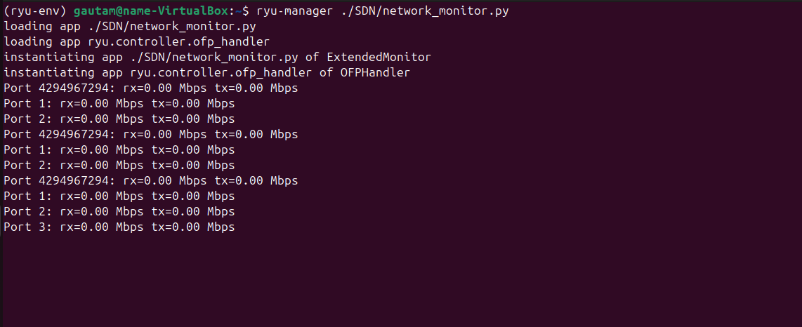
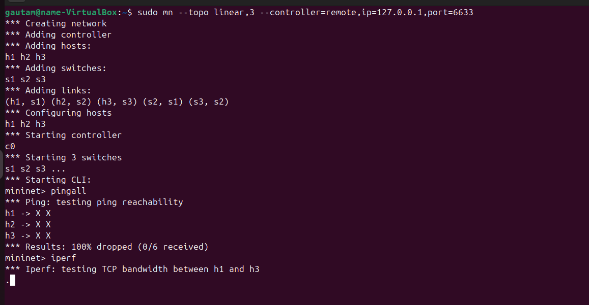
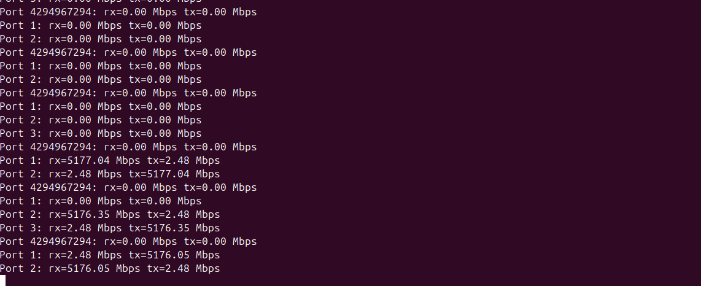
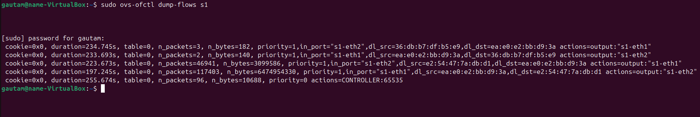

# SDN Mininet – Orange Problem

## Project Description
This project demonstrates the design and implementation of a Software‑Defined Networking (SDN) solution using **Mininet** as the network emulator and the **Ryu controller** as the control plane. The custom Ryu application integrates three core functions:
- **Forwarding logic**: Learns MAC addresses and installs flow rules for efficient packet forwarding.  
- **Firewall rule**: Blocks traffic between specific hosts to enforce policies.  
- **Bandwidth monitoring**: Periodically polls OpenFlow switches for port statistics, calculates utilization in Mbps, and logs results.

Validation is done through Mininet experiments:
- **Connectivity tests** (`pingall`) to show allowed vs blocked traffic.  
- **Traffic generation** (`iperf`) to measure throughput.  
- **Flow table inspection** (`ovs-ofctl dump-flows`) to confirm controller‑installed rules.  

---

## Pre-Execution Steps
1. **install Python version 3.9 or lower for full utilization of Ryu**
   
2. **install Mininet**
   
3. **Create a virtual enviroment for safe Ryu controller usage**
   ```bash
   python3 -m venv ryu-env
   source ryu-env/bin/activate
   ```

## Setup & Execution Steps
1. **Run the controller**  
   ```bash
   ryu-manager code/extended_monitor.py
   
2. **Start Mininet topology**
   ```bash
   sudo mn --topo linear,3 --controller=remote,ip=127.0.0.1,port=6633

3. **Test connectivity**
   ```bash
   pingall

4. **Generate traffic**
     ```bash
     iperf h1 h2

5. **Inspect flow tables**
     ```bash
     sudo ovs-ofctl dump-flows s1

## Expected Output
1. **Ryu Starup**
   

2. **Mininet**
   

3. **Results**
  

4. **Flowtable**
   
